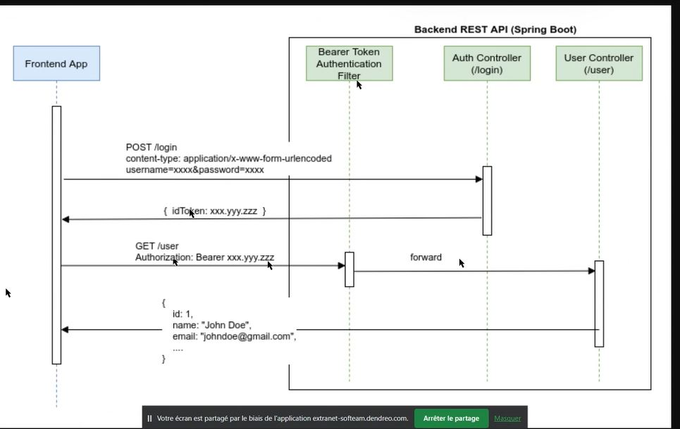
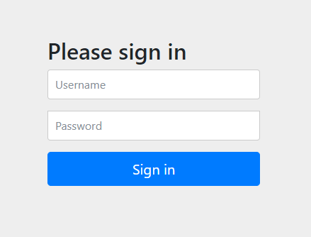

# JWT JSON Web Token
Un JWT, les JSON Web Token, signé se compose de trois parties codées en base64 et séparées par un point : 
HEADER.PAYLOAD.SIGNATURE

Voici un schéma d'échange : 
   


# Authenticate Users With Sessions
Ce fait en utilisant un Cookie : `JSESSIONID`.  
1- Le client s'authentifié avec un login/password         
```json
{
    "username": "foo",
    "password": "bar"
    }
```
2- Le serveur vérifie si si l'user est valide, si oui il crée un object session en mémoire identifié par JSESSIONID. il 
retourne le cookie dans un header : 
  >Set-Cookie: JSESSIONID=B2236C29AC9CBE6FE0DC02A61596554D; Path=/; HttpOnly

3- Pour les prochaines request, le client peut utiliser le cookie récupéré JSESSIONID pour faire d'autre appels
>Cookie: JSESSIONID=B2236C29AC9CBE6FE0DC02A61596554D

4- Later, the client sends a GET request to the /logout endpoint to terminate the current session.  
5- The server handles this request by invalidating the session object corresponding to the provided JSESSIONID.


# Paramétrer Spring security dans un projet : 
    
  ```xml
      <dependency>
          <groupId>org.springframework.boot</groupId>
          <artifactId>spring-boot-starter-security</artifactId>
      </dependency>
  ```

- By adding Spring Security as a dependency, all requests require authentication by default. We can see this by starting
the Spring Boot application locally and going to http://localhost:8080/ with a web browser. We should be redirected to 
Spring Security’s default login page, http://localhost:8080/login  

- Since our Spring Boot application has no users, there is no way to sign in. We can create users by defining a Spring 
bean that returns a UserDetailsService in a new WebSecurityConfiguration class : 

```java
@Configuration
@EnableWebSecurity
public class WebSecurityConfiguration { 
    @Bean
    public UserDetailsService users() {
    UserDetails user = User.builder()
    .username("user")
    .password("{noop}password")
    .roles("USER")
    .build();

    UserDetails admin = User.builder()
        .username("admin")
        .password("{noop}password")
        .roles("ADMIN")
        .build();
        
    return new InMemoryUserDetailsManager(user, admin);
   }
}
```




- On définit w Spring bean that returns a SecurityFilterChain in the WebSecurityConfiguration , afin de sécuriser les
méthode GET /users et GET /admins selon les rôle 

```java
    @Configuration
    @EnableWebSecurity
    public class WebSecurityConfiguration {
    
    @Bean
    public SecurityFilterChain securityFilterChain(HttpSecurity http) throws Exception {
        http.authorizeHttpRequests(
             requests ->
                requests
                    .requestMatchers(HttpMethod.GET, "/users")
                    .hasRole("USER")
                    .requestMatchers(HttpMethod.GET, "/admins")
                    .hasRole("ADMIN")
                    .anyRequest()
                    .authenticated()
                    )
        .formLogin(Customizer.withDefaults());
    return http.build();
    }
```


