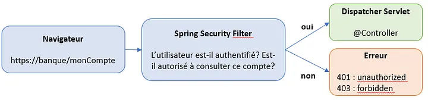
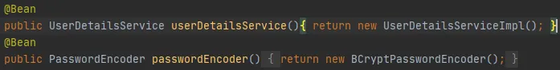
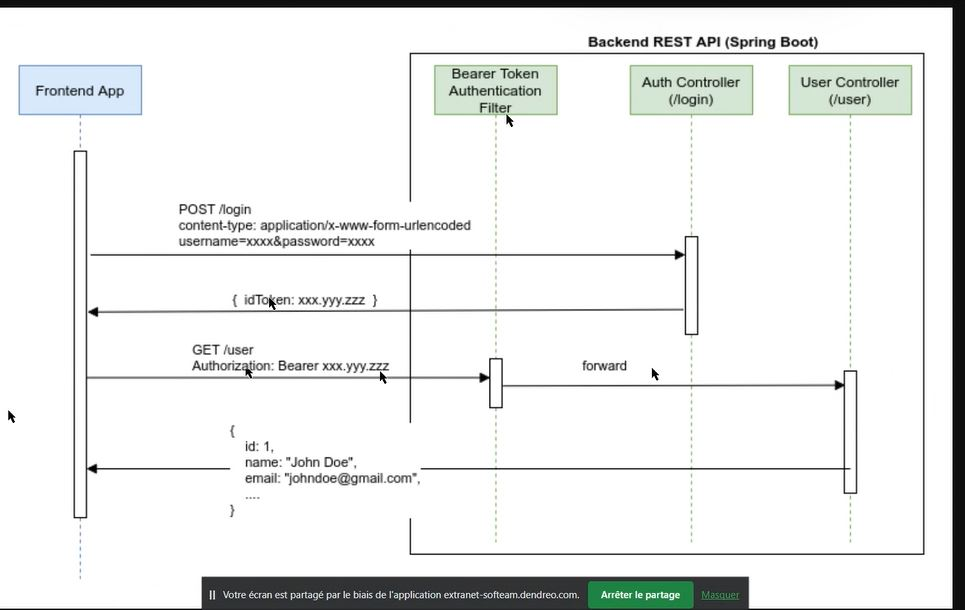
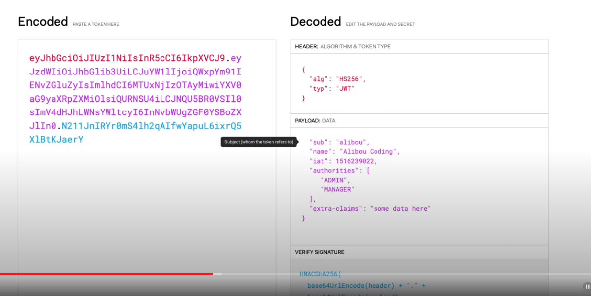
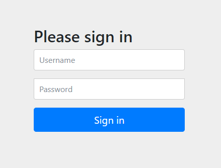

# Introduction  
Le schéma de déroulement d'une requête HTTP:   



## Spring security Filter  : Filter Chain 
Les filtres Spring Security sont responsables de la protection des ressources, de la gestion de l'authentification,
de l'autorisation et de la sécurité globale de l'application. Ils interviennent dans le traitement des requêtes HTTP 
entrantes et sortantes pour garantir que seules les personnes autorisées accèdent aux ressources protégées

Le composants par défaut de `Filter chain` dans l'ordre, sont les suivants : 

- CsrfFilter : Gère la protection CSRF en ajoutant ou en vérifiant le jeton CSRF dans les demandes POST
- authorizeHttpRequests : Gère la vérification des autorisations pour les demandes
- UsernamePasswordAuthenticationFilter  :  Ce filtre gère le processus d'authentification pour les demandes de connexion 
basées sur un nom d'utilisateur et un mot de passe.   
- FilterChainProxy : Il orchestre l'ordre d'exécution des autres filtres et les exécute en séquence.
- BasicAuthenticationFilter : Vérifie la présence dans la requête reçue d’un header de type basic auth, et le cas 
échéant, essaie d’authentifier l’utilisateur avec le couple username/password récupéré dans ce header

# Focus sur l’authentification
1. Les données des utilisateurs (identifiant + mot de passe) sont stockés dans une base de données à laquelle le
développeur a accès : c’est le cas le plus courant, et celui qui sera détaillé ici.    

2. L’application n’a pas directement accès à ces informations et doit passer par exemple par un service REST tiers pour
l’authentification. Ce cas s’applique par exemple dans le cadre d’une utilisation d’Atlassian Crowd. On retiendra qu’il
se traite comme le premier cas, à l’exception de cette couche intermédiaire d’interrogation du service 
d’authentification qu’il faut ajouter.   

3. L’authentification est effectuée via OAuth2 (cas d’un “login with Google” par exemple). Ce cas demande nettement plus
d’explications et ne sera pas détaillé ici.    

# Focus sur l’autorisation
Spring Security distingue deux objets relatifs à l’autorisation :

- Les Authorities : dans sa forme la plus basique, une Authority n’est qu’une simple chaîne de caractères désignant une
responsabilité : “user”, “ADMIN”, “grandDictateurEnChef”…

- Les Roles : un Role n’est ni plus ni moins qu’une Authority précédée du préfixe “ROLE_”


# JWT JSON Web Token
Un JWT, les JSON Web Token, signé se compose de trois parties codées en base64 et séparées par un 
point : HEADER.PAYLOAD.SIGNATURE    

Pour les authentification type base de données où les données des utilisateurs (identifiant + mot de passe) sont stockés,
deux Beans doivent être déclars :    
  - UserDetailsService  :
    l’implémentation de cette interface doit comporter une méthode renvoyant un objet de type UserDetails à partir d’un 
simple identifiant d’utilisateur. Cet objet contient à minima le couple username/password, ainsi que généralement la 
liste des rôles (c’est à dire les autorisations) de l’utilisateur. Il est tout à fait possible d’utiliser/d’étendre 
les implémentations toutes faites fournies par Spring Security.

  - PasswordEncoder   
permet de spécifier quel algorithme d’encryption utiliser sur les mots de passe. L’algorithme par défaut de Spring 
Security est BCrypt. Il est tout à fait possible d’utiliser différents algorithmes selon les utilisateurs, option sur 
laquelle nous ne nous attarderons pas.   





Voici un schéma d'échange : 
   

See https://jwt.io/ for more détails



## Génération de la clé secret   
https://www.grc.com/passwords.htm 
https://generate-random.org/encryption-key-generator


# Authenticate Users With Sessions
Ce fait en utilisant un Cookie : `JSESSIONID`.  
1- Le client s'authentifié avec un login/password         
```json
{
    "username": "foo",
    "password": "bar"
    }
```
2- Le serveur vérifie si si l'user est valide, si oui il crée un object session en mémoire identifié par JSESSIONID. il 
retourne le cookie dans un header : 
  >Set-Cookie: JSESSIONID=B2236C29AC9CBE6FE0DC02A61596554D; Path=/; HttpOnly

3- Pour les prochaines request, le client peut utiliser le cookie récupéré JSESSIONID pour faire d'autre appels
>Cookie: JSESSIONID=B2236C29AC9CBE6FE0DC02A61596554D

4- Later, the client sends a GET request to the /logout endpoint to terminate the current session.  
5- The server handles this request by invalidating the session object corresponding to the provided JSESSIONID.


# Paramétrer Spring security dans un projet : 
    
  ```xml
      <dependency>
          <groupId>org.springframework.boot</groupId>
          <artifactId>spring-boot-starter-security</artifactId>
      </dependency>
  ```

- By adding Spring Security as a dependency, all requests require authentication by default. We can see this by starting
the Spring Boot application locally and going to http://localhost:8080/ with a web browser. We should be redirected to 
Spring Security’s default login page, http://localhost:8080/login  

- Since our Spring Boot application has no users, there is no way to sign in. We can create users by defining a Spring 
bean that returns a UserDetailsService in a new WebSecurityConfiguration class : 

```java
@Configuration
@EnableWebSecurity
public class WebSecurityConfiguration { 
    @Bean
    public UserDetailsService users() {
    UserDetails user = User.builder()
    .username("user")
    .password("{noop}password")
    .roles("USER")
    .build();

    UserDetails admin = User.builder()
        .username("admin")
        .password("{noop}password")
        .roles("ADMIN")
        .build();
        
    return new InMemoryUserDetailsManager(user, admin);
   }
}
```



- On définit w Spring bean that returns a SecurityFilterChain in the WebSecurityConfiguration , afin de sécuriser les
méthode GET /users et GET /admins selon les rôle 

```java
    @Configuration
    @EnableWebSecurity
    public class WebSecurityConfiguration {
    
    @Bean
    public SecurityFilterChain securityFilterChain(HttpSecurity http) throws Exception {
        http.authorizeHttpRequests(
             requests ->
                requests
                    .requestMatchers(HttpMethod.GET, "/users")
                    .hasRole("USER")
                    .requestMatchers(HttpMethod.GET, "/admins")
                    .hasRole("ADMIN")
                    .anyRequest()
                    .authenticated()
                    )
        .formLogin(Customizer.withDefaults());
    return http.build();
    }
```


