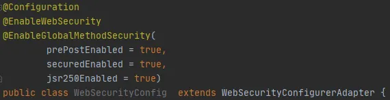

# Défense en profondeur       
Souvent, la sécurité que nous  paramétrons ne concerne que les pages web de l’application et leur accès, 
ce qui est tout a fait suffisant dans la plupart des cas.   

Pour renforcer encore la sécurité, il existe la notion de “defense in depth”, que je propose audacieusement
de traduire par “défense en profondeur” : 
 
>il s’agit de contrôler l’accès aux méthodes que l’on peut trouver dans les @Controllers, 
les @Components, les @Services, les @Repositories, et autres beans Spring

Cette approche est mise en place par le biais d’annotations affectant les méthodes publiques des beans. Pour rendre 
possible cette sécurité supplémentaire, il est nécessaire de l’autoriser explicitement dans la classe annotée 
@Configuration que nous avons survolée dans la partie précédente, en ajoutant
l’annotation `@EnableGlobalMethodSecurity` :     

    

- `prePostEnabled` : permet d’utiliser les annotations @PreAuthorize et @PostAuthorize    
- `securedEnabled` : permet d’utiliser l’annotation @Secured (voir les exemples ci-après).    
- `jsr250Enabled` : permet d’utiliser l’annotation @RolesAllowed (voir les exemples ci-après).   
