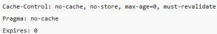

# Type de protection  
## CSRF   
il est possible d’utiliser le CsrfFilter de Spring Security (voir la partie sur la Filter Chain) en ajoutant la 
méthode csrf() à la configuration de la sécurité web 

## Headers   

1. cache control   
Le comportement par défaut de Spring Security est de ne conserver aucune information en cache
  

2. content type options   
Spring Security désactive la détection automatique du format de certaines ressources : images, textes,.. en ajoutant 
ce header  
   

3. http strict transport security  
   omettre “https” dans une requête dans la barre d’adresse, même si le site cible redirige automatiquement vers une 
adresse https, expose à une attaque de type “man in the middle”. Spring Security dispose d’un header ajoutant
automatiquement “https” à une liste de sites :

   

4. x-frame-options 
autoriser son site à être ajouté à une frame peut soulever des problèmes de sécurité. Par exemple, 
l’utilisation (certes fastidieuse) de CSS permettrait de faire cliquer l’utilisateur sur un élément masqué, 
causant alors un comportement non prévu. Ce type d’attaque est connue sous le nom de ClickJacking. Une façon 
d’éviter le clickJacking est de désactiver le rendu des pages au sein des frames. Spring Security utilise ce 
contournement avec le header suivant :   

  

5. x-xss-protection   
Par défaut, Spring Security bloque le contenu perçu comme malveillant en utilisant ce header :    
    

6. clear-site data  
L’utilisation d’un header comme celui présenté ci-dessous est une bonne pratique de nettoyage à mettre en place 
lors d’une déconnexion :  

  

