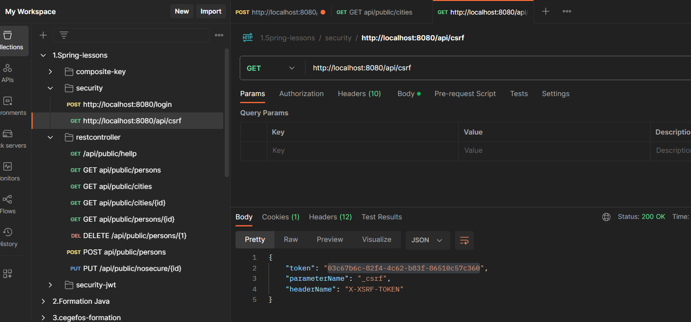

# Example d'implémentation  

- Configuration 

```java
@Bean
public SecurityFilterChain securityFilterChain(HttpSecurity http) throws Exception {
    http.csrf()
            .csrfTokenRepository(csrfTokenRepository())
            .and()
            .authorizeHttpRequests(
                requests ->
                    requests
                        .antMatchers("/api/public/**").permitAll()
                        .antMatchers("/api/csrf").permitAll()
                        .antMatchers("/users")
                        .hasRole("USER")
                        .antMatchers("/admins")
                        .hasRole("ADMIN")
                        .anyRequest()
                        .authenticated())
            .formLogin(Customizer.withDefaults());
    return http.build();
}

@Bean
public CsrfTokenRepository csrfTokenRepository() {
    HttpSessionCsrfTokenRepository repository = new HttpSessionCsrfTokenRepository();
    repository.setHeaderName("X-XSRF-TOKEN"); // Name of the header to send the CSRF token
    return repository;
}
        
```


- Récup de token csrf  

get http://localhost:8080/api/csrf

```json
{
"token": "03c67b6c-82f4-4c62-b83f-86510c57c360",
"parameterName": "_csrf",
"headerName": "X-XSRF-TOKEN"
}
```




Controller 
```java
@RestController
@RequestMapping("/api")
public class CsrfController {

    @RequestMapping("/csrf")
    public CsrfToken csrf(HttpServletRequest request) {
        return (CsrfToken) request.getAttribute("_csrf");
    }
}
```