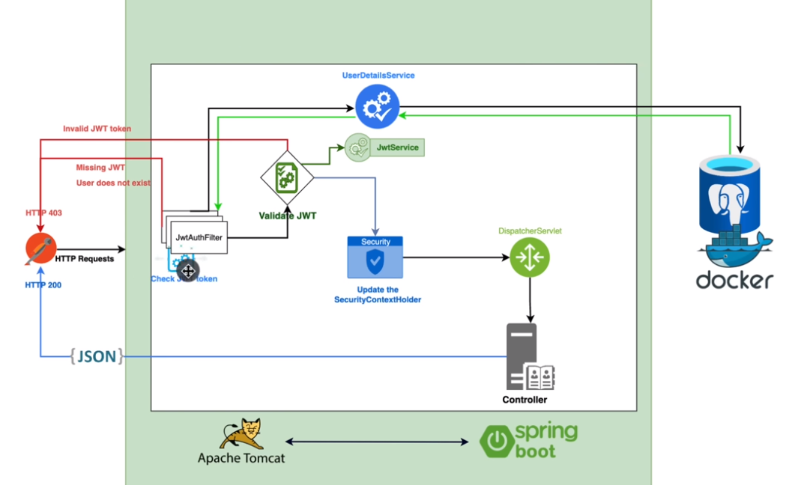

# Spring Security : JWT
Pour implémenter la couche de sécurity, on a plusieurs composants : 

1- `JwtAuthFilter`    : Check JWT Token, the first thing execute
Il extrait l'username or email 
Il vérifie grace UserDetailsService si l'utilisateur existe, si error :user does not exist 

On peut avoir plusieurs erreurs : 
   + Invalid JWT Token (403) 
   + Missing JWT 
   + User does not exist 
   + Token expired 
   + Token is not for this user 

2- `UserDetailsService` : Utiliser par JwtAuthFilter pour récupérer les information en base de 
   l'utilisateur 

3- SecurityContextHolder :  
  - FilterChain : seter l'user comme il esr authantifié 
  - Communicate with DispatcherServlet 

4- DispatcherServlet   
  il dispatche au controleur selon l'uri 

Http (/api/autheticate) => JwtAuthFilter => UserDetailsService       
                                         => Validate Jwt => SecurityContextHolder => 
## Schémas des transfert   

   


## JwtAuthFilter   
GenericFilterBean and OncePerRequestFilter are both classes provided by Spring Security for 
implementing custom filters in your security filter chain. The choice between these two 
depends on your specific use case and requirements.

Here's a brief comparison of the two:   

### GenericFilterBean
- This is a simpler and more lightweight option.    
- It doesn't provide built-in support for ensuring that the filter is only executed once per request, which means you need to handle that yourself if needed.
- Typically used for stateless filters that do not rely on shared state between filter invocations.
- Suitable when you don't need to address issues related to multiple filter executions per request.

```java
public class MyFilter extends GenericFilterBean {
@Override
public void doFilter(ServletRequest request, ServletResponse response, FilterChain chain)
throws IOException, ServletException {
// Filter logic here
chain.doFilter(request, response);
}
}
```

### OncePerRequestFilter:
- This is a more advanced and robust option.
- Extends GenericFilterBean and ensures that the filter is executed only once per request, regardless of how many times 
it's added to the filter chain.
- Suitable when you need to guarantee that your filter logic runs exactly once per request.
- Commonly used for filters that rely on shared state or caching between filter invocations.

```java
public class MyFilter extends OncePerRequestFilter {
@Override
protected void doFilterInternal(HttpServletRequest request, HttpServletResponse response, FilterChain chain)
throws ServletException, IOException {
// Filter logic here
chain.doFilter(request, response);
}
}
```


*Recommendation:*     

> If you have a simple stateless filter that doesn't rely on shared state or you are confident that multiple executions 
per request won't cause issues, you can use GenericFilterBean for simplicity.

>  If your filter relies on shared state or needs to ensure that it's executed only once per request (which is often the
case with security-related filters), it's recommended to use OncePerRequestFilter to avoid potential issues.

>  In most Spring Security scenarios, when you're dealing with authentication, authorization, or any stateful operations,
it's advisable to use OncePerRequestFilter to ensure the expected behavior. It provides the necessary safeguards to 
prevent unintended multiple executions per request and is considered a best practice for security filters in Spring 
Security applications.


# Exemple complet pour implémnter JWT  
https://www.youtube.com/watch?v=KxqlJblhzfI
https://github.com/ali-bouali/spring-boot-3-jwt-security/tree/main

Table of content
00:00 Intro
01:55 How JWT security works
07:26Create a new spring boot 3.0 project
09:28 Add Data source
12:28 Connect to the database
17:12 Create user class
20:05 Transform the User to an entity
25:22 Extend the user to UserDeatils object
33:32 Create the user repository
35:50 Create the JWT authentication filter
40:58 Checking the JWT token
44:32 Create the JWT service
47:56 Add the JJWT dependencies
49:59 What is a JWT token
53:06 Extract claims from JWT
55:23 Implement the getSignInKey method
01:00:07 Extract a single claim from JWT
01:01:51 Extract the username from the token
01:02:52 Generate the JWT token
01:08:15 Check if the token is valid
01:11:22 Check the user existence in the database (JwtAuthFilter)
01:15:13 Implement the UserDetailsService
01:19:38 Update the SecurityContextHolder and finalise the filter
01:23:53 Add the security configuration
01:32:51 Create the authentication provider bean
01:36:41 Create the authentication manager bean
01:38:14 Create the authentication controller
01:40:55 Create the authentication response class
01:41:47 Create the register request object
01:42:50 Create the authentication request class
01:43:22 Create the authentication service
01:45:37 Implement the register method
01:49:28 Implement the authenticate method
01:52:17 Update the security configuration whitelist
01:53:35 Create a demo controller
01:54:55 Test the changes


