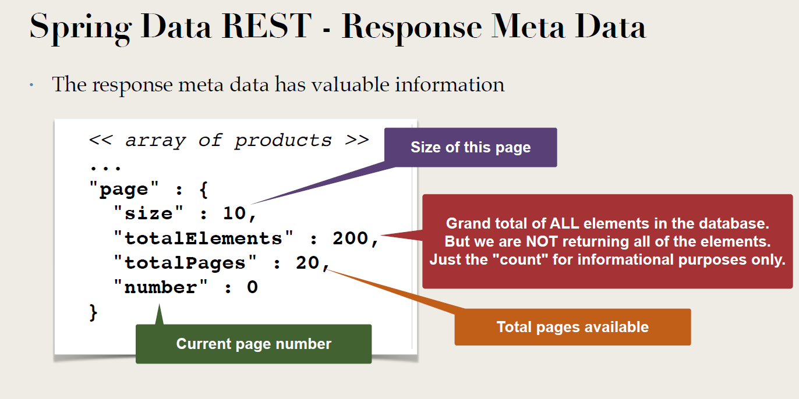
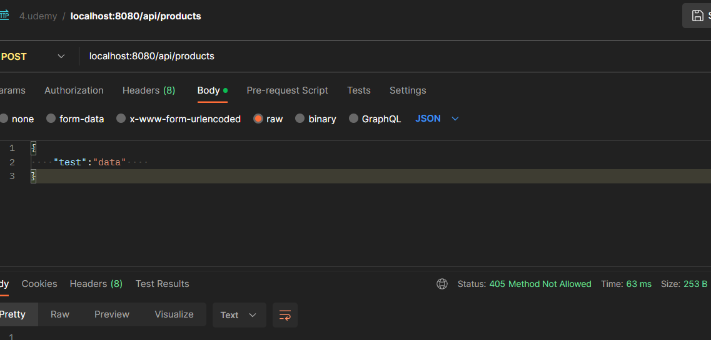

# API REST  
Dans Spring, on a deux type d'impléméntations : 

- Spring MVC pour Rest 
- Spring Data Rest 

1.  Spring MVC pour Rest 

2. Spring data Rest 

Exemple 

> localhost:8080/api/products?page=0&size=2
```json 
   {
   "_embedded": {
   "products": [
   {
   "id": 1,
   "sku": "BOOK-TECH-1000",
   "name": "Crash Course in Python",
   "description": "Learn Python at your own pace. The author explains how the technology works in easy-to-understand language. This book includes working examples that you can apply to your own projects. Purchase the book and get started today!",
            .....
      },
      "page": {
      "size": 2,
      "totalElements": 100,
      "totalPages": 50,
      "number": 0
      }
   }
```

Type response :    



## Spring Data Rest - Read Only   

> I want the REST API as READ-ONLY

Par défaut, Spring Data expose tous les endpoints  : GET, POST, PUT, DELETE, .. en gratuit : All privilèges 

Exemple : comment désactiver les méthodes POST, PUT et DELETE  
Les solutions : 
 - *Option 1* : Creer mes controller à partir de @RestCOntroller et définir les méthodes que le controller doit exposer , 
   exemple : @GetMapping

Sauf comme ça on perd le pouvoir de Spring Data Rest   

- *Option 2*  : utilsier Spring Data Rest mais en désactivant les méthodes HTTP : GET, POST, DELETE, ...

- 

```java 
@Configuration
public class MyDatarestConfig implements RepositoryRestConfigurer {

    //ReadOnly
    @Override
    public void configureRepositoryRestConfiguration(RepositoryRestConfiguration config, CorsRegistry cors) {

        HttpMethod[] theUnsupportedActions = {HttpMethod.PUT, HttpMethod.POST, HttpMethod.DELETE};

        //Disable HTTP methods for Product : PUT, POTS et DELETE
        config.getExposureConfiguration()
                .forDomainType(Product.class)
                .withItemExposure((metdata, httpMethods) -> httpMethods.disable(theUnsupportedActions))
                .withCollectionExposure((metdata, httpMethods) -> httpMethods.disable(theUnsupportedActions));

        //Disable HTTP methods for ProductCategory : PUT, POTS et DELETE
        config.getExposureConfiguration()
                .forDomainType(ProductCategory.class)
                .withItemExposure((metdata, httpMethods) -> httpMethods.disable(theUnsupportedActions))
                .withCollectionExposure((metdata, httpMethods) -> httpMethods.disable(theUnsupportedActions));
    }
}
```

